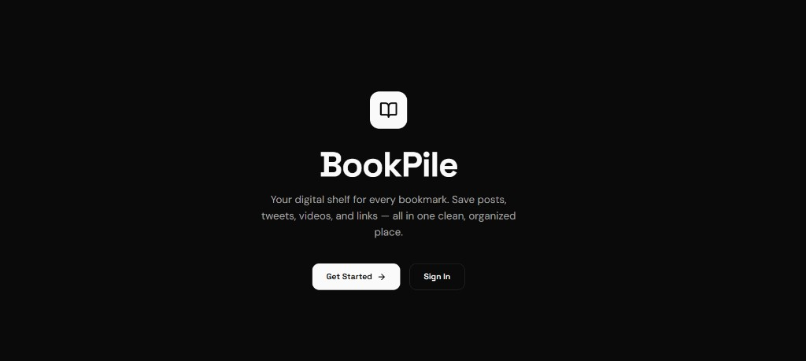

<div align="center">

# BookPile

### Your digital shelf for every bookmark.

Save posts, tweets, videos, courses, and links — all in one clean, organized place.

[](https://bpile.vercel.app)



</div>

---

Stop losing great content across dozens of browser tabs and scattered bookmark folders. **BookPile** gives you a single, beautiful dashboard to save and organize anything you find online — whether it's a Facebook post, a tweet, a Reddit thread, a YouTube video, or a random article you want to revisit later.

Sign up in seconds, paste a URL, and BookPile handles the rest.

## Features

- **Smart Bookmark Import** — Paste any URL and BookPile automatically fetches the title, description, and Open Graph image. No manual entry needed.
- **Platform-Aware Organization** — Bookmarks are tagged by platform (Facebook, X, Reddit, YouTube, Instagram, LinkedIn, GitHub, and more) with recognizable icons and brand colors.
- **Flexible Topics** — Categorize bookmarks with built-in topics like Tech, Programming, Science, or Design — or create your own custom topics on the fly.
- **Sidebar Navigation** — Browse bookmarks by platform, by topic, or view everything at once. Expandable platform sections reveal nested topic breakdowns.
- **Search** — Instantly filter bookmarks by headline with real-time search.
- **Full CRUD** — Add, edit, and delete bookmarks with confirmation dialogs and loading feedback.
- **Image Upload** — Upload custom images for bookmarks when the auto-fetched image isn't right.
- **Dark / Light Mode** — Clean black-and-white theme with a smooth toggle. Your preference is saved locally.
- **Responsive Design** — Works on desktop, tablet, and mobile with a collapsible sidebar and adaptive grid layout.
- **Authentication** — Secure email/password signup and login powered by NextAuth.js.

## Tech Stack

| Layer | Technology |
|-------|------------|
| Framework | [Next.js 15](https://nextjs.org/) (App Router) |
| Language | [TypeScript](https://www.typescriptlang.org/) |
| Styling | [Tailwind CSS v4](https://tailwindcss.com/) |
| Database | [MongoDB](https://www.mongodb.com/) + [Mongoose](https://mongoosejs.com/) |
| Authentication | [NextAuth.js v5](https://authjs.dev/) (Credentials) |
| Icons | [Lucide React](https://lucide.dev/) |
| Fonts | [Space Grotesk](https://fonts.google.com/specimen/Space+Grotesk) + [DM Sans](https://fonts.google.com/specimen/DM+Sans) |
| Deployment | [Vercel](https://vercel.com/) |

## Getting Started

### Prerequisites

- [Node.js](https://nodejs.org/) 18.17 or later
- [pnpm](https://pnpm.io/) (recommended) or npm
- A [MongoDB](https://www.mongodb.com/) database (local or [Atlas](https://www.mongodb.com/atlas))

### Installation

1. **Clone the repository**

```bash
git clone https://github.com/your-username/bookpile.git
cd bookpile
```

2. **Install dependencies**

```bash
pnpm install
```

3. **Set up environment variables**

Create a `.env.local` file in the root directory:

```env
MONGODB_URI=mongodb://localhost:27017/bookpile
AUTH_SECRET=your-random-secret-string-at-least-32-characters
AUTH_URL=http://localhost:3000
```

> Replace `MONGODB_URI` with your MongoDB Atlas connection string for production. Generate `AUTH_SECRET` with `openssl rand -base64 32` or any random string generator.

4. **Run the development server**

```bash
pnpm dev
```

Open [http://localhost:3000](http://localhost:3000) to see the app.

### Building for Production

```bash
pnpm build
pnpm start
```

## Deployment

BookPile is ready to deploy on **Vercel**:

1. Push your code to a GitHub repository.
2. Import the project on [vercel.com](https://vercel.com/new).
3. Add the environment variables (`MONGODB_URI`, `AUTH_SECRET`, `AUTH_URL`) in the Vercel dashboard under **Settings > Environment Variables**.
4. Deploy.

> Set `AUTH_URL` to your production domain (e.g. `https://bookpile.vercel.app`).

## Project Structure

```
bookpile/
├── app/
│   ├── (auth)/           # Login & Signup pages
│   ├── (main)/           # Dashboard & Add Bookmark pages
│   ├── api/              # API routes (bookmarks, auth, upload, og-image, topics)
│   ├── globals.css       # Tailwind theme & custom styles
│   ├── layout.tsx        # Root layout with providers
│   └── page.tsx          # Landing page
├── components/
│   ├── bookmarks/        # BookmarkCard, BookmarkGrid, BookmarkEditForm, PlatformSelect, TopicSelect
│   ├── layout/           # Header, Sidebar, ThemeToggle
│   ├── providers/        # ThemeProvider, SessionProvider
│   └── ui/               # Modal, Toast
├── lib/
│   ├── models/           # Mongoose schemas (User, Bookmark)
│   ├── auth.ts           # NextAuth configuration
│   ├── auth.config.ts    # Edge-compatible auth config
│   ├── mongodb.ts        # Database connection
│   └── utils.ts          # Helper functions
├── public/
│   └── platforms/        # Platform SVG icons
└── types/
    └── index.ts          # TypeScript types & constants
```

## License

This project is open source and available under the [MIT License](LICENSE).
